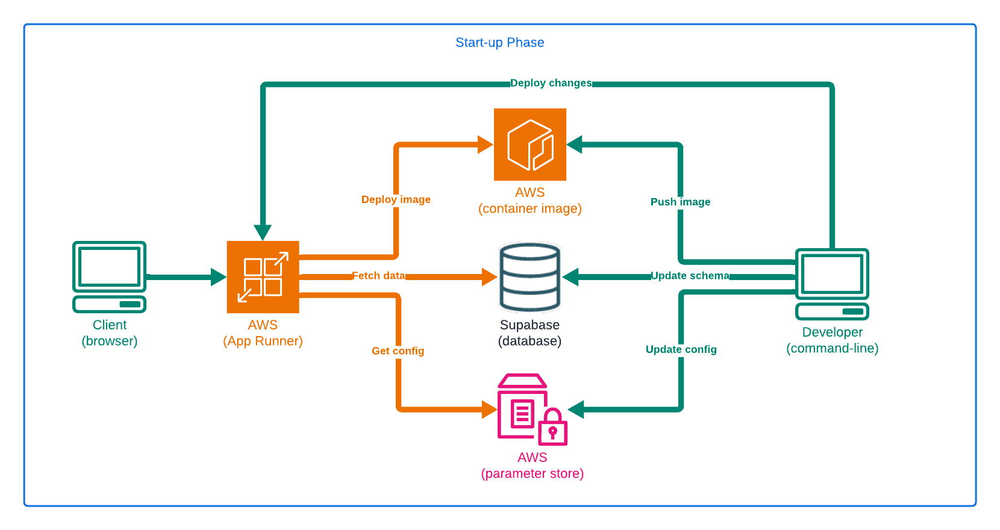
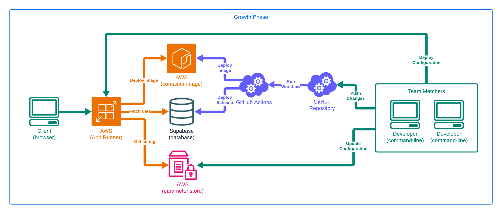

# Fullstack Deployment: From Containers to Production AWS

Gain real-world fullstack deployment experience from the startup, growth and scale stages of an application.

---

# Introduction to Teacher

---

## Erik Reinert aka "Blackglasses"

- Senior software engineer
- Content creator (@TheAltF4Stream)
- Diagram & flowchart artist
- Habitual problem solver

---

## Work Experience

- Started with frontend (2+ years)
- Followed curiosity to backend (2+ years)
- Continued curiosity to fullstack (2+ years)
- Found passion in DevOps & Platform Engineering (4+ years - current)

---

## I build things on the internet

- Twitch: https://www.twitch.tv/thealtf4stream
- YouTube: https://www.youtube.com/thealtf4stream
- Twitter: https://www.x.com/thealtf4stream
- Blog: https://altf4.blog

---

## Existing Courses

- Introduction to DevOps for Developers
- Enterprise Cloud Infrastructure
- Introduction to Backend Architectures

---

## Introduction to DevOps for Developers

Take your first steps into DevOps guided from the perspective of a developer! Improve software teams’ ability to build and ship software reliably.

---

## Enterprise Cloud Infrastructure

Learn to set up large-scale systems with GitOps and optimized CI/CD workflows. And see strategies to standardize your organization's approach to AWS resource management and dynamic cloud orchestration.

---

## Introduction to Backend Architectures

Learn about architectural backend design principles, challenges, real-world applications, while offering a detailed understanding of when and how to implement them.

---

# Course Introduction

---

## Goals in this course

- Manage growing infrastructure
- Learn when to make changes
- Balance pros and cons of solutions
- Improve hands-on experience

---

## Pre-requisites for this course

- Fundamental knowledge of Docker
- Experience using Git and GitHub
- Basic understanding of AWS
- Command-line and scripting experience
- AWS account with admin privileges
- GCP account with project
- Supabase account with free plan

---

# Course Structure

---

## Separate Phases

- Each focuses on unique scenarios
- Each implements unique solutions
- Each provides valuable takeaways

---

## Three Phases

- Start-Up Phase
- Growth Phase
- Scale Phase

---

## Start-Up Phase

> "Just get it working!"

---

## Growth Phase

> "We gotta go fast!"

---

## Scale Phase

> "Plan for the future!"

---

## Final Branches

- Start-Up
  - https://github.com/ALT-F4-LLC/fem-fd-service/tree/stage-01-start-up
- Growth
  - https://github.com/ALT-F4-LLC/fem-fd-service/tree/stage-02-growth
- Scale
  - https://github.com/ALT-F4-LLC/fem-fd-service/tree/stage-03-scale

---

## Working Branch

- Workshop
  - https://github.com/ALT-F4-LLC/fem-fd-service/tree/workshop

---

## Start-Up Phase

> "Just get it working!"

---

## Phase Scenario

- We have source code managed by a development team
- We need quickest deployment with minimal effort required
- We are looking for biggest wins with minimal required to setup
- We are learning about what needs to be maintained

---

## Phase Goals

- Create repository to store source code
- Create database deployment for production
- Create application deployment for production

---

## Phase Requirements

- Setup Docker latest version
- Setup Go latest version
- Setup GitHub account
- Setup GCP account
- Setup AWS account, CLI & credentials
- Setup Supabase account

---

---

## Start building!

---

## Phase Changes

- added only one file to our repository (Dockerfile)
- all other changes done in the cloud
- heavily dependent on vendor-based solutions

---

## Phase Pros

- turn-key environment
    - 99% of the work is in the browser
- easy deployments
    - automatic updates with new images
    - manual deploy configurations
- horizontal scalability
- basic monitoring

---

## Phase Cons

- no reproducibility
- no extensibility
- no automation
- multiple vendor lock-ins (AWS, Supabase)

---

## Growth Phase

> "We gotta go fast!"

---

## Phase Scenario

- We are shipping code to production
- We have no integration process
- We have no delivery process
- We don’t want to replace anything

---

## Phase Goals

- We need to improve data reliability
- We need to improve developer experience
- We need to create integration solution
- We need to create delivery solution

---

## Phase Requirements

- Setup Docker latest version
- Setup Go latest version
- Setup GitHub account
- Setup GCP account
- Setup AWS account, CLI & credentials
- Setup Supabase account

---

---

## Start building!

---

## Phase Changes

- added database migrations for schema changes
- added makefile for developers and automation
- added multi-stage Dockerfile for different uses
- added build step for code changes validation
- added test step for schema migration changes
- added deploy step for automated deployments
- added support for future integrations to be added

---

## Phase Pros

- no impactful changes were made
- improved schema management
- improved developer productivity
- improved code reliability with integration jobs
- improved code lifecycle with delivery jobs

---

## Phase Cons

- no infrastructure management
- no staging environment
- no network isolation
- no service support

---

## Scale Phase

> "Plan for the future!"

---

## Phase Scenario

- We want to support multiple teams
- We want minimal deployment friction
- We want longterm architected solutions
- We have “some” money to spend

---

## Phase Goals

- Create infrastructure automation
- Create cloud environments
- Create promotion process
- Create application observability

---

## Phase Requirements

- Setup Docker latest version
- Setup Go latest version
- Setup GitHub account
- Setup GCP account
- Setup AWS account, CLI & credentials

---

---

## Start building!

---

## Phase Changes

- added state with bucket
- added network, database, cluster and service
- added multiple environment support
- added jobs for running Terraform
- updated migrations to run on ECS
- updated deployments to go to ECS

---

## Phase Pros

- automates cloud management
- consolidates cloud resources
- standardizes infrastructure
- supports future solutions

---

## Phase Cons

- requires a team to manage
- requires custom solutions
- requires more complexity
- requires shared knowledge

---

# Course Recap

---

## What did we do?

- proposed different scenarios
- evaulated multiple solutions
- iterated over existing changes
- adapted for future scenarios

---

## What did we learn?

- how to approach different scenarios
- how to make impactful decisions
- how to manage growing infrastructure
- how to maintain deployment strategies

---

##  Thanks for watching

---

## I build things on the internet

- Github (personal): https://github.com/erikreinert
- Github (company): https://github.com/ALT-F4-LLC
- Twitch: https://www.twitch.tv/thealtf4stream
- YouTube: https://www.youtube.com/thealtf4stream
- Twitter: https://www.x.com/thealtf4stream
- Blog: https://altf4.blog