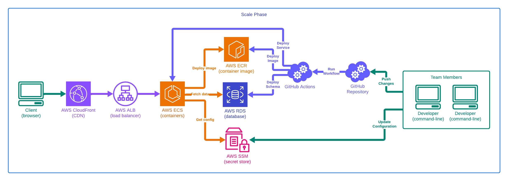

# Fullstack Deployment: From Containers to Production AWS

Gain real-world experience through startup, growth, and scale stages of an application.

---

# Introduction to Teacher

---

## Erik Reinert aka "Blackglasses"

- Senior Software Engineer
- Content Creator (@TheAltF4Stream on Twitch and YouTube)
- Diagram & Flowchart Artist
- Habitual Problem Solver

---

## Erik Reinert aka "Blackglasses"

Find me online:

- Twitch: https://www.twitch.tv/thealtf4stream
- YouTube: https://www.youtube.com/thealtf4stream
- Twitter: https://www.x.com/thealtf4stream
- Blog: https://altf4.blog

---

## Experience

- Started with frontend (2+ years)
- Followed curiosity to backend (2+ years)
- Continued curiosity to fullstack (2+ years)
- Found passion in DevOps & Platform Engineering (4+ years - current)

---

## Existing Courses

- Introduction to DevOps for Developers
- Enterprise Cloud Infrastructure
- Introduction to Backend Architectures

---

## Introduction to DevOps for Developers

> Take your first steps into DevOps guided from the perspective of a developer! Improve software teams’ ability to build and ship software reliably.

---

## Enterprise Cloud Infrastructure

> Learn to set up large-scale systems with GitOps and optimized CI/CD workflows. And see strategies to standardize your organization's approach to AWS resource management and dynamic cloud orchestration.

---

## Introduction to Backend Architectures

> Learn about architectural backend design principles, challenges, real-world applications, while offering a detailed understanding of when and how to implement them.

---

# Introduction to Course

---

## Goals in this course are

- Build evolving infrastructure
- Understand different scenarios
- Learn deployment strategies

---

## Are there pre-requisites for this course?

- Fundamental knowledge of Docker
- Experience using Git and GitHub
- Basic understanding of AWS
- Command-line experience
- Active AWS account with admin privileges

---

# Workshop Structure

---

## Separate Phases

- Focus on unique solution
- Determine impactful goals
- Provide valuable takeaways

---

## Separate Phases

1. Start-Up
2. Growth
3. Scale

---

## Start-Up Phase

> "Just get it working!"

---

## Start-Up Phase

- We have source code managed by a development team
- We need quickest deployment with minimal effort required
- We are looking for biggest wins with minimal required to setup
- We are learning about what needs to be maintained

---

## Start-Up Phase

- Create repository
- Create application
- Create database
- Create deployment

---

---

## Growth Phase

> "We gotta go fast!"

---

## Growth Phase

- Improve data reliability
- Improve developer experience
- Create integration solution
- Create delivery solution

---

## Growth Phase

- Create infrastructure automation
- Create cloud environments
- Create promotion process
- Create application observability

---

---

## Scale Phase

> "Plan for the future!"

---

## Scale Phase

- We want to support multiple teams
- We want minimal deployment friction
- We want longterm architected solutions
- We have “some” money to spend

---

## Scale Phase

- Create infrastructure automation
- Create cloud environments
- Create promotion process
- Create application observability

---

---

## Separate Phases

- Start-Up: https://github.com/ALT-F4-LLC/fem-fd-service/tree/stage-01-start-up
- Growth: https://github.com/ALT-F4-LLC/fem-fd-service/tree/stage-02-growth
- Scale: https://github.com/ALT-F4-LLC/fem-fd-service/tree/stage-03-scale

---

# Start-Up Phase

---

---

## Start building!

---

## Changes

- added only one file to our repository (Dockerfile)
- all other changes are done in the cloud
- relies on vendor-based solutions

---

## Pros

- turn-key environment
    - 99% of the work is in the browser
- easy deployments
    - automatic updates with new images
    - manual deploy configurations
- horizontal scalability
- basic monitoring

---

## Cons

- no reproducibility
- no extensibility
- no automation
- multiple vendor lock-in (AWS, Supabase)

---

# Growth Phase

---

---

## Start building!

---

## Changes

- added database migrations for schema changes
- added makefile for developers and automation
- added multi-stage Dockerfile for different uses
- added build step for code changes validation
- added test step for schema migration changes
- added deploy step for automated deployments
- added support for future integrations to be added

---

## Pros

- no impactful changes were made
- improved schema management
- improved developer productivity
- improved code reliability with integration jobs
- improved code lifecycle with delivery jobs

---

## Cons

- no infrastructure management
- no staging environment
- no network isolation
- no service support

---

# Scale Phase

---

---

## Start building!

---

## Changes

- added state with bucket
- added network, database, cluster and service
- added multiple environment support
- added jobs for running Terraform
- updated migrations to run on ECS
- updated deployments to go to ECS

---

## Pros

- automates cloud management
- consolidates cloud resources
- standardizes infrastructure
- supports future solutions

---

## Cons

- requires a team to manage
- requires custom solutions
- requires more complexity
- requires shared knowledge

---

# Course Recap

---

## What did we do?

- proposed different unique scenarios
- implemented fitting solutions
- iterated over existing solutions
- adapted to future scenarios

---

## What did we learn?

- how to approach different scenarios
- how to grow with evolving source code
- how to manage evolving infrastructure
- how to create deployment strategies

---

##  Thanks for hanging out

---

##  Find me online

- Twitch: https://www.twitch.tv/thealtf4stream
- YouTube: https://www.youtube.com/thealtf4stream
- Twitter: https://www.x.com/thealtf4stream
- Blog: https://altf4.blog